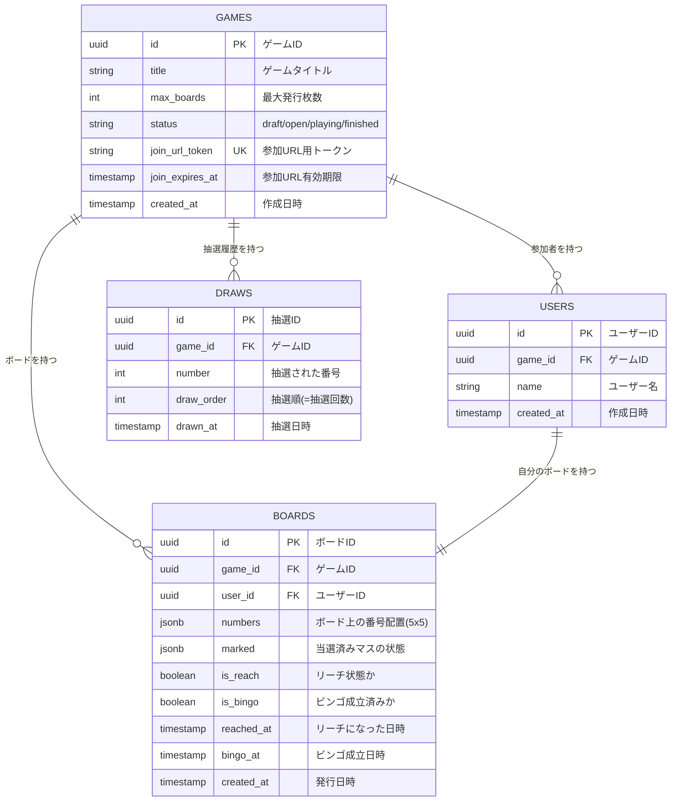
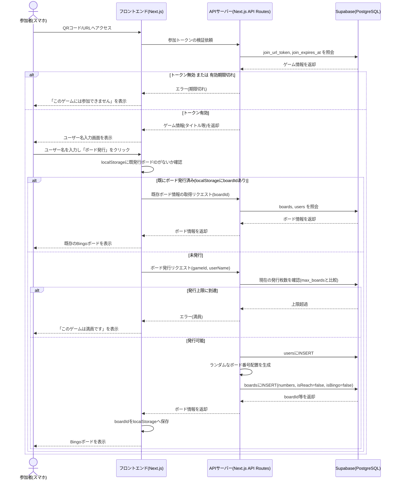
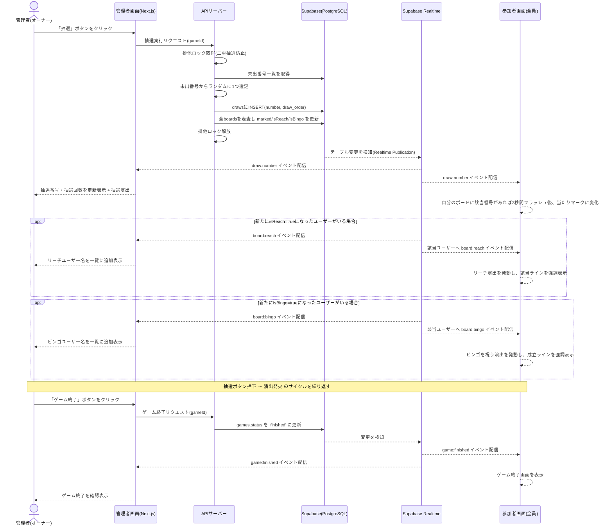

# ViVi! Bingo!

オンラインBingoゲームです。
オーナーがオンラインでBingo大会を開催し、参加者がスマホからURL/QRコード経由で参加してリアルタイムに進行する抽選ゲームに参加できるWebアプリです。想定同時参加者数は最大100名程度、単発〜数回のイベント利用を想定しています。
※本アプリは、AIで実装しています。

## 特徴

- 参加者はURL/QRコードにアクセスし、名前を入力するだけで5×5のBingoボードを発行できる
- 管理者が抽選を実行すると、Supabase Realtime経由で全参加者の画面に即座に反映される
- リーチ・ビンゴの判定はサーバー側（API Routes）でのみ行い、不正な当落操作を防止
- リーチ・ビンゴ成立時のアニメーション演出、ルーレット/ガラポン形式の抽選演出付き
- リロードしても同じBingoボードを復元表示（localStorageにboardIdを保存）

## 技術スタック

| レイヤー | 技術 |
|---|---|
| フロントエンド／バックエンド | Next.js (App Router, TypeScript) |
| DB | Supabase (PostgreSQL) |
| リアルタイム配信 | Supabase Realtime |
| スタイリング | Tailwind CSS |
| QRコード生成 | `qrcode` |
| 演出 | `canvas-confetti`, CSS/Canvasアニメーション |
| ホスティング | Vercel（アプリ）、Supabase（DB/Realtime） |

## セットアップ

### 前提

- Node.js
- Supabase CLI（DBマイグレーション適用に使用）
- Supabaseプロジェクト（[supabase.com](https://supabase.com)で作成、またはローカルCLIで起動）

### 手順

```bash
npm install
```

`.env.local` を作成し、Supabaseプロジェクトの接続情報を設定します。

```bash
NEXT_PUBLIC_SUPABASE_URL=your-project-url
NEXT_PUBLIC_SUPABASE_PUBLISHABLE_KEY=your-publishable-key
SUPABASE_SECRET_KEY=your-secret-key
```

- `NEXT_PUBLIC_SUPABASE_PUBLISHABLE_KEY` はブラウザ用クライアント（`src/lib/supabase.ts`）で使用
- `SUPABASE_SECRET_KEY` はRLSをバイパスするサーバー専用クライアント（`src/lib/supabase-admin.ts`）で使用。API Routes以外からは絶対にimportしないこと

DBマイグレーションを適用します。

```bash
npx supabase link --project-ref <your-project-ref>
npx supabase db push
```

開発サーバーを起動します。

```bash
npm run dev
```

[http://localhost:3000](http://localhost:3000) で参加者向けトップページが表示されます。管理画面は `/admin` 配下です。

## よく使うコマンド

```bash
npm run dev     # 開発サーバー起動（next dev, Turbopack）
npm run build   # 本番ビルド
npm run start   # 本番サーバー起動（build後）
npm run lint    # ESLint実行
```

## プロジェクト構成

```
src/
  app/
    page.tsx                          # トップページ
    admin/                            # 管理者画面（ゲーム作成・進行・抽選）
    join/[token]/                     # 参加画面（URL/QR経由でのボード発行）
    boards/[boardId]/                 # 参加者のBingoボード画面
    api/                              # API Routes
      games/                         # ゲーム作成・取得・終了
      games/[gameId]/boards/         # ボード発行
      games/[gameId]/draws/          # 抽選実行
      join/[token]/                  # 参加URLトークンの検証
      boards/[boardId]/              # ボード情報取得
  components/                         # 共通コンポーネント（QRコード、抽選演出 等）
  lib/                                 # Supabaseクライアント、Bingoロジック等
supabase/
  migrations/                          # DBマイグレーション
```

## データモデル

`games` / `users` / `boards` / `draws` の4テーブル構成です。



- `games`: ゲーム基本情報、参加URLトークン、有効期限、ステータス
- `users`: ゲームに参加したユーザー（`game_id`にスコープ）
- `boards`: 発行済みBingoボード。番号配置(`numbers`)・当選状態(`marked`)をJSONBで保持、`is_reach`/`is_bingo`カラムあり
- `draws`: 抽選履歴（抽選番号・抽選順）

## 主な仕様

- ボードは5×5マス、中央はFREE（初期状態から開いている、抽選対象外）
- 抽選番号は1〜75。列ごとに範囲を区切る（B:1-15 / I:16-30 / N:31-45 / G:46-60 / O:61-75）
- ビンゴ成立ラインは縦5・横5・斜め2の計12ライン
- 参加URLの有効期限はデフォルト24時間、ゲーム開設時にオーナーが変更可能
- 当落判定（`is_reach`/`is_bingo`の更新）は必ずサーバー側（API Routes）で行う
- 抽選実行はサーバー側で排他制御し、二重抽選を防止
- 同一ゲーム内でのユーザー名の重複は許容する（内部的には`user_id`で区別）

## 処理フロー

### 参加〜ボード発行



### 抽選〜Realtime配信〜ゲーム終了



## APIレスポンス規約

- 成功時: リソースを表すJSONをそのまま返す（`{ data: ... }` 等でラップしない）
- 失敗時: `{ error: { message: string } }` + 適切なHTTPステータス（400=バリデーションエラー、404=Not Found、409=競合、500=サーバーエラー 等）
- DBカラムは`snake_case`のままだが、APIリクエスト/レスポンスのJSONは`camelCase`に変換する

## デプロイ

[Vercel](https://vercel.com) にデプロイします。Vercelプロジェクトの環境変数に、上記の3つのSupabase接続情報を設定してください。

Supabase無料プランは1週間アクセスがないとプロジェクトが自動休止するため、本番開催の前に管理者がダッシュボードへアクセスし、稼働状態を確認してください。また無料プランには自動バックアップがないため、ゲーム終了後に結果データを残したい場合は手動エクスポートを行ってください。
